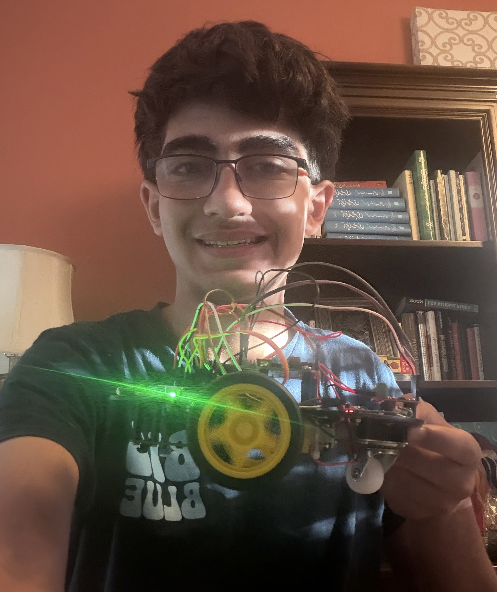
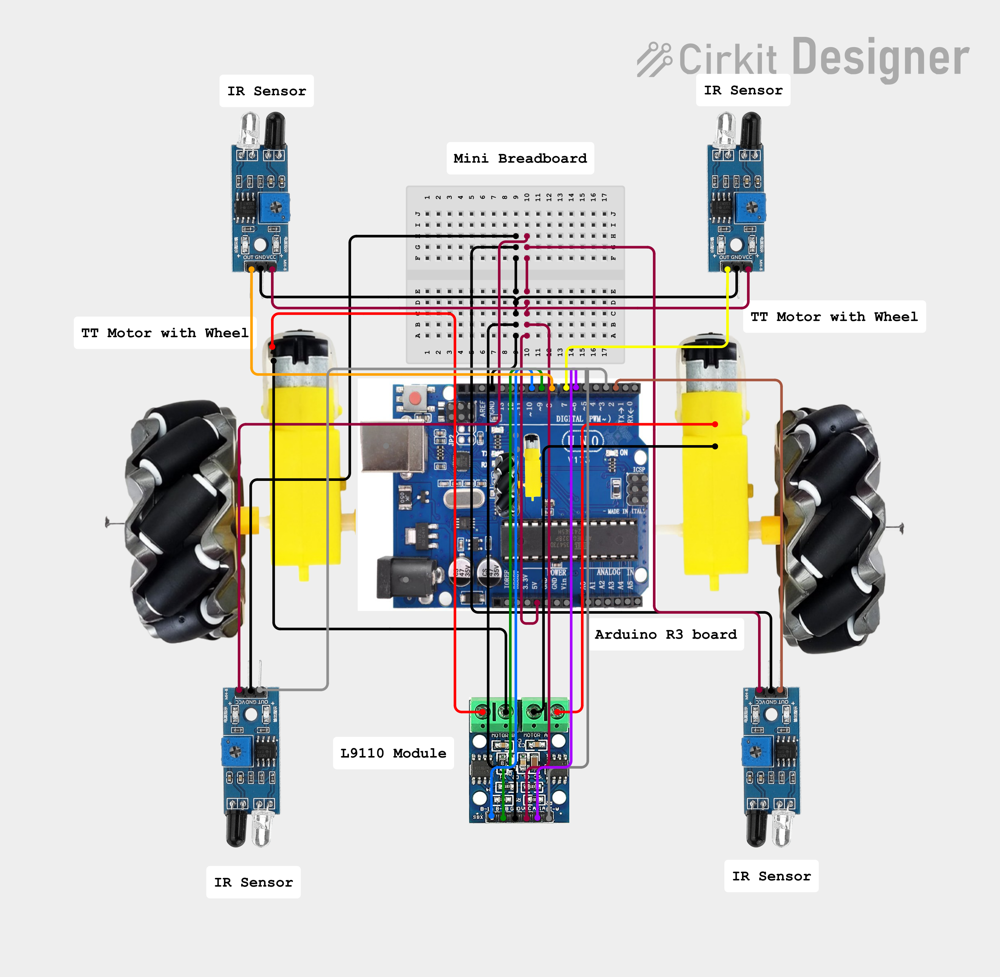

# Self-Driving Car
<!--- Replace this text with a brief description (2-3 sentences) of your project. This description should draw the reader in and make them interested in what you've built. You can include what the biggest challenges, takeaways, and triumphs from completing the project were. As you complete your portfolio, remember your audience is less familiar than you are with all that your project entails! --->

  My modified version of the Self Driving Car can autonomously navigate obstacles without any user output, cleverly utilizing four IR "Infrared" sensors. Noticing that the base self driving car from SunFounder's Ultimate Starter kit lacked any sensors on the rear, which is a hazard when reversing, I implented two new IR sensors on the back left and right of the car. During this project, I further deepened my understanding in electrical engineering and robotics and honed in on many of my skills.


<!---  Self Driving Cars are becoming more and more common, with companies like Waymo and Zoox providing taxi services with self driving cars, while Tesla allows users to not have to stress about driving when behind the wheel. That's why I chose to build a self driving car for my project, using the Sunfounder Ultimate Starter Kit as a base. Once the car was built, it was able to operate hands free using the Arduino IDE. I added two extra IR sensors to the rear to allow the car to also prevent crashes when reversing all on it's own.   --->


<!---You should comment out all portions of your portfolio that you have not completed yet, as well as any instructions:--->
<!--- This is an HTML comment in Markdown -->
<!--- Anything between these symbols will not render on the published site -->

| **Engineer** | **School** | **Area of Interest** | **Grade** |
|:--:|:--:|:--:|:--:|
| Omid H | Dougherty Valley High School | Computer Engineering | Incoming Sophomore

<!---**Replace the BlueStamp logo below with an image of yourself and your completed project. Follow the guide [here](https://tomcam.github.io/least-github-pages/adding-images-github-pages-site.html) if you need help.**--->



  
# Final Milestone

<!--- **Don't forget to replace the text below with the embedding for your milestone video. Go to Youtube, click Share -> Embed, and copy and paste the code to replace what's below.**

<iframe width="560" height="315" src="https://www.youtube.com/embed/F7M7imOVGug" title="YouTube video player" frameborder="0" allow="accelerometer; autoplay; clipboard-write; encrypted-media; gyroscope; picture-in-picture; web-share" allowfullscreen></iframe>

For your final milestone, explain the outcome of your project. Key details to include are:
- What you've accomplished since your previous milestone
- What your biggest challenges and triumphs were at BSE
- A summary of key topics you learned about
- What you hope to learn in the future after everything you've learned at BSE
--->

## Summary


# Second Milestone

<!--- **Don't forget to replace the text below with the embedding for your milestone video. Go to Youtube, click Share -> Embed, and copy and paste the code to replace what's below.**

<iframe width="560" height="315" src="https://www.youtube.com/embed/y3VAmNlER5Y" title="YouTube video player" frameborder="0" allow="accelerometer; autoplay; clipboard-write; encrypted-media; gyroscope; picture-in-picture; web-share" allowfullscreen></iframe>

For your second milestone, explain what you've worked on since your previous milestone. You can highlight:
- Technical details of what you've accomplished and how they contribute to the final goal
- What has been surprising about the project so far
- Previous challenges you faced that you overcame
- What needs to be completed before your final milestone --->

## Summary

# First Milestone

<iframe width="560" height="315" src="https://www.youtube.com/embed/syKjGWBMcLM?si=NhIhl2jI2TpljYSL" title="YouTube video player" frameborder="0" allow="accelerometer; autoplay; clipboard-write; encrypted-media; gyroscope; picture-in-picture; web-share" referrerpolicy="strict-origin-when-cross-origin" allowfullscreen></iframe>

<!---For your first milestone, describe what your project is and how you plan to build it. You can include:
- An explanation about the different components of your project and how they will all integrate together
- Technical progress you've made so far
- Challenges you're facing and solving in your future milestones
- What your plan is to complete your project--->

## Summary
In my first milestone, I assembled the basic design for the self-driving car. The car is powered by a single 9V battery, which is connected to the Arduino R3 board by a 9V battery cable. The R3 board provides 5V of power to the mini-breadboard through a red wire and ground is connected by a black wire to the same mini-breadboard. The two yellow TT motors are connected by two wires each to the L9110 module. The module acts as a bridge between the TT motors and the R3 board, communicating the board's commands to the motors effectively. On the other side of the L9110 module, there are six wires in groups of two that connect back to the aforementioned mini-breadboard. Those outgoing wires from the R3 board that I mentioned before (5V and GND) connect to these and complete the link. The orientation of the six wires on the mini-breadboard from the module dictate which way the car will go. To the left and right of the mini-breadboard, there are two IR (Infrared) Object Avoidance Sensors. These sensors use Infrared waves to help avoid objects and prevent crashes. Located on the mini-breadboard, across the center ravine from the previous wires, there is an ultrasonic sensor that can track distance and can help to prevent crashes. Directly below the mini-breadboard, there is a line-tracking module. This module helps to keep the car straight when following a line. That is the detailed breakdown of the basic design for my self-driving car after completing my first milestone. 

# Schematics 
<!---Here's where you'll put images of your schematics. [Tinkercad](https://www.tinkercad.com/blog/official-guide-to-tinkercad-circuits) and [Fritzing](https://fritzing.org/learning/) are both great resoruces to create professional schematic diagrams, though BSE recommends Tinkercad becuase it can be done easily and for free in the browser.--->





# Code
<!--- Here's where you'll put your code. The syntax below places it into a block of code. Follow the guide [here]([url](https://www.markdownguide.org/extended-syntax/)) to learn how to customize it to your project needs. --->

```c++
#include <EEPROM.h>

float leftOffset = 1.0;
float rightOffset = 1.0;

const int A_1B = 5;
const int A_1A = 6;
const int B_1B = 9;
const int B_1A = 10;

const int rightIR = 2;
const int leftIR = 7;
const int backRightIR = 12;
const int backLeftIR = 13;

bool reversing = false;

void setup() {
Serial.begin(9600);

EEPROM.write(0, 100); //write the offset to the left motor
EEPROM.write(1, 56); //write the offset to the right motor
rightOffset = EEPROM.read(0) * 0.01; //read the offset
leftOffset = EEPROM.read(1) * 0.01;//read the offset

//motor
pinMode(A_1B, OUTPUT);
pinMode(A_1A, OUTPUT);
pinMode(B_1B, OUTPUT);
pinMode(B_1A, OUTPUT);

//IR obstacle
pinMode(leftIR, INPUT);
pinMode(rightIR, INPUT);
pinMode(backLeftIR, INPUT);
pinMode(backRightIR, INPUT);

}

void loop() {

int left = digitalRead(leftIR);
int right = digitalRead(rightIR);
int backLeftState = digitalRead(backLeftIR);
int backRightState = digitalRead(backRightIR);
int speed = 255;

if (reversing) {

if (!backLeftState || !backRightState) {
reversing = false;
moveForward(speed);
} else {
moveBackward(speed);
}

} else {

if (!left || !right) {
reversing = true;
moveBackward(speed);
} else {
moveForward(speed);
}

}
}


void moveForward(int speed) {
analogWrite(A_1B, 0);
analogWrite(A_1A, int(speed * leftOffset));
analogWrite(B_1B, int(speed * rightOffset));
analogWrite(B_1A, 0);
}

void moveBackward(int speed) {
analogWrite(A_1B, int(speed * leftOffset));
analogWrite(A_1A, 0);
analogWrite(B_1B, 0);
analogWrite(B_1A, int(speed * rightOffset));
}

void backLeft(int speed) {
analogWrite(A_1B, speed);
analogWrite(A_1A, 0);
analogWrite(B_1B, 0);
analogWrite(B_1A, 0);
}

void backRight(int speed) {
analogWrite(A_1B, 0);
analogWrite(A_1A, 0);
analogWrite(B_1B, 0);
analogWrite(B_1A, speed);
}
```

# Bill of Materials
<!---Here's where you'll list the parts in your project. To add more rows, just copy and paste the example rows below.
Don't forget to place the link of where to buy each component inside the quotation marks in the corresponding row after href =. Follow the guide [here]([url](https://www.markdownguide.org/extended-syntax/)) to learn how to customize this to your project needs.--->

| **Part** | **Note** | **Price** | **Link** |
|:--:|:--:|:--:|:--:|
| SunFounder Ultimate Starter Kit | Building the base car | $59.99 | <a href="https://shorturl.at/1DRoX"> Link </a> |
| Amazon 8-pack of 9V batteries | Power/battery | $12.69 | <a href="https://shorturl.at/HBrm5"> Link </a> |
| Digital Multimeter | Checking the voltage of batteries | $9.98 | <a href="https://shorturl.at/0CSOv"> Link </a> |
| Anker USB C to A adapter | Connecting the Arduino to my Macbook Air | $9.18 | <a href="https://shorturl.at/1uAjG"> Link </a> |
| IR "Infrared" Obstacle Avoidance Sensors | Rear sensors for self-driving car | $9.99 | <a href="https://shorturl.at/mRN3r"> Link </a> |
| 4 sets TT motor with leads | Replacements for motors and wheels | $9.69 | <a href="https://shorturl.at/ImE4p"> Link </a> |

# Resources
<!---One of the best parts about Github is that you can view how other people set up their own work. Here are some past BSE portfolios that are awesome examples. You can view how they set up their portfolio, and you can view their index.md files to understand how they implemented different portfolio components.--->
- [Resource 1](https://shorturl.at/6DsLe)
- [Resource 2](https://app.cirkitdesigner.com/)
- [Resource 3](https://www.shorturl.at/shortener.php) 

<!--- To watch the BSE tutorial on how to create a portfolio, click here. --->
